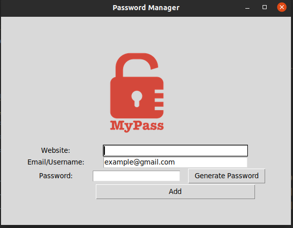

# Project Name
> Password Manager GUI

## General Information
- A demo to create password manager by Tkinter to generate and save password locally.


## Technologies Used
- Python
- Tkinter


## Screenshots

<!-- If you have screenshots you'd like to share, include them here. -->


## Setup
1. Clone the repo
   ```sh
   git clone https://github.com/quocluong32/password_manager_GUI.git
   ```
2. Open terminal and run
  ```sh
   python3 main.py
  ```

## Acknowledgements
- This project was inspired by 100 Days of Code - The Complete Python Pro Bootcamp - Angela Yu.

